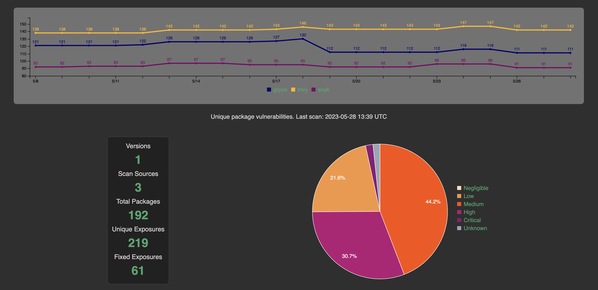
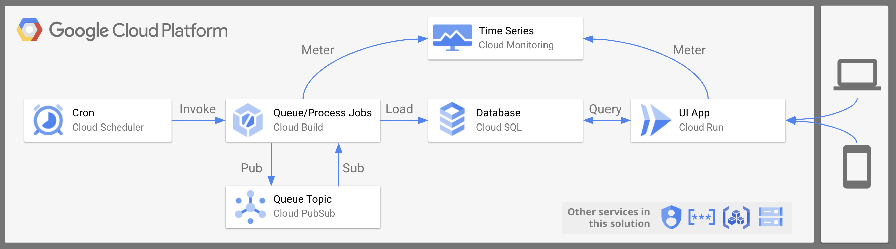

# vul

End-to-end solution for tracking image vulnerabilities over time using most popular open source vulnerability scanners (e.g. [grype](https://github.com/anchore/grype), [snyk](https://github.com/snyk/cli), [trivy](https://github.com/aquasecurity/trivy)). Fully functional demo available at: https://vul.thingz.io.



## deployment

To deploy the pre-built version of this solution: 



### prerequisites

The deploy this solution you will need:

* [Terraform CLI](https://www.terraform.io/downloads)
* [GCP Project](https://cloud.google.com/resource-manager/docs/creating-managing-projects)
* [gcloud CLI](https://cloud.google.com/sdk/gcloud) (aka Google Cloud SDK)

### setup

Start by cloning this repo, and navigate to the terraform folder in cloned repository:

```shell
git clone git@github.com:mchmarny/vul.git
cd vul/deployment/public
```

Next, authenticate to GCP:

```shell
gcloud auth application-default login
```

Initialize the Terraform configuration: 

```shell
terraform init
```

> Note, this flow uses the default, local terraform state. Make sure you do not check the state files into your source control (see `.gitignore`), or consider using persistent state provider like GCS.

### config

Next, rename the existing sample config file [config/secret-sample.yaml](config/secret-sample.yaml) to `secret-prod.yaml`, and update the following values (they are marked by comments starting with `UPDATE`):

* `project_id` - your GCP project ID
* `location` - your GCP location (aka region)
* `store.password` - your preferred Postgres DB password (make it strong)
* `import.snyk_token` - your Snyk API token

> Make sure to save the file after making changes.

You also can edit the list of images that will be monitored in [workflow/image.txt](workflow/image.txt). You can add and remove images from that file later too. 

### deployment

When done, deploy the solution:

```shell
terraform apply
```

If everything went ok, you should see output including app service URL:

> Your URL will be different. 

```shell
APP_SERVICE_URL = "https://vul-nxccxqb4iq-uw.a.run.app"
```

## test

The deployment has created a Cloud Scheduler named `vul-queue-image-schedule` that, unless modified, runs every 8 hours. To load the initial data manually, force the schedule job run in either the [GCP Console UI](https://console.cloud.google.com/cloudscheduler), or by running the `gcloud` command:

> Note, update the location if you changed it during the deployment,

```shell
gcloud scheduler jobs run vul-queue-image-schedule --location us-west1
```

Now, in [Cloud Build UI](https://console.cloud.google.com/cloud-build/builds;region=us-west1) you should see first the `vul-queue-image` job run that spools the content of [workflow/image.txt](workflow/image.txt) onto the PubSub queue, and then `vul-process-image` job for each one of these images. When these jobs complete, you should see your data in the UI.

## cleanup

To clean all the resources provisioned by this setup, navigate into your deployment directory (`cd deployment/public`), and run:

```shell
terraform destroy
```

> Note, some resources like the database, are set to prevent accidental deletes. That setting will have to be disabled manually before `terraform` will be able to delete them.

## Disclaimer

This is my personal project and it does not represent my employer. While I do my best to ensure that everything works, I take no responsibility for issues caused by this code.
